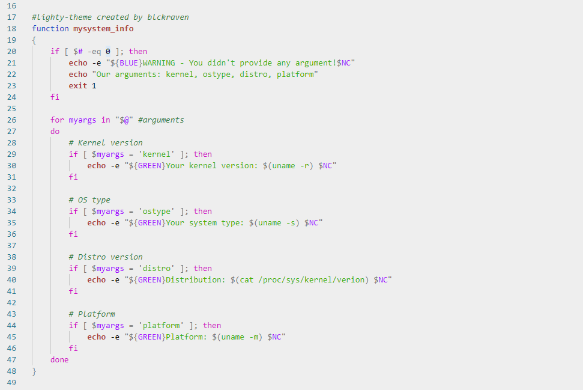

  

<h2 align="center">Lighty Theme</h2>
<h5 align="center">Dark version: <a href="https://github/blckraven/vscode-hcker-theme">here</a></h5>
<h5 align="center">VSCode Marketplace: <a href="https://marketplace.visualstudio.com/items?itemName=blckraven.lighty-theme">Lighty Theme</a></h5>

Light & modern theme for Your code.

